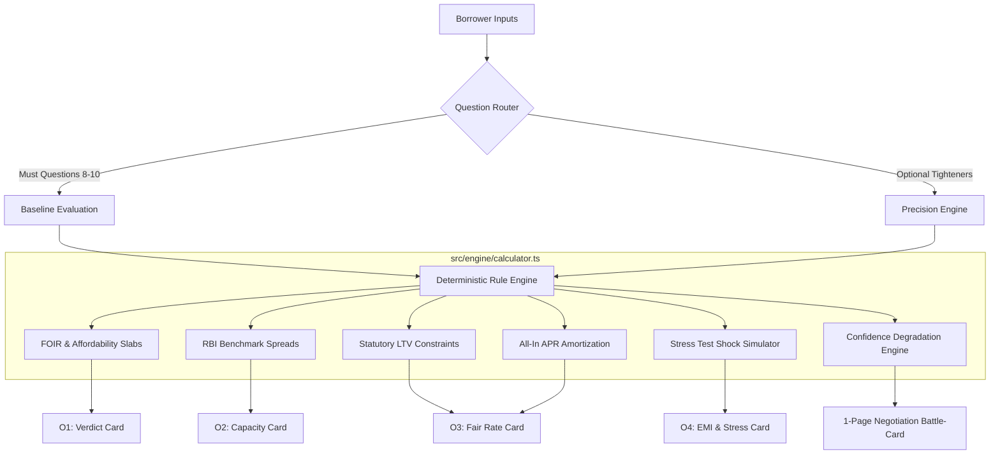

# Borrower Copilot · Indian Borrower Self-Assessment & Negotiation Assistant

[](https://github.com/RahulNaikMudavath/Borrower-Copilot)
[](https://www.typescriptlang.org/)
[](https://react.dev/)
[](https://tailwindcss.com/)
[](https://render.com)
[](https://github.com/RahulNaikMudavath/Borrower-Copilot)

> **"What we are really testing: can you turn lending judgement into rules a borrower can see and a machine can run? That is the whole company."**

**Borrower Copilot** is a personal financial assistant designed to empower everyday Indian borrowers before they walk into a bank or NBFC branch. It runs 100% locally from self-reported inputs — **no login, no bureau pull, no personal data harvested, zero tracking**.

It answers the four existential borrowing questions and generates a **1-Page Negotiation Battle-Card** with counter-offer scripts and walk-away red lines.

---

## 📑 Table of Contents
- [Why Borrower Copilot? (The Asymmetry Gap)](#-why-borrower-copilot-the-asymmetry-gap)
- [The 4 Core Outputs & Negotiation Card](#-the-4-core-outputs--negotiation-card)
- [The 5 Cardinal Rules We Built By](#-the-5-cardinal-rules-we-built-by)
- [The 3 Benchmark Personas](#-the-3-benchmark-personas)
- [Architecture & Engine Design](#-architecture--engine-design)
- [Four Deliverables at Root](#-four-deliverables-at-root)
- [Quick Start & Local Setup](#-quick-start--local-setup)
- [Deploying to Render (Free Static Site)](#-deploying-to-render-free-static-site)
- [Automated Engine Test Suite](#-automated-engine-test-suite)
- [Product Roadmap: What We Build Next & What We Cut](#-product-roadmap-what-we-build-next--what-we-cut)

---

## 🎯 Why Borrower Copilot? (The Asymmetry Gap)

Every lender in India deploys sophisticated algorithmic models to maximize loan size, processing fees, and interest margin. **The borrower has nothing.** They walk into the branch blind, take the first sanction letter offered, and discover years later that they were overcharged by 300–500 basis points and stretched their debt-to-income (FOIR) to 65%.

Borrower Copilot transforms the borrower into the best-informed person in the room through transparent financial heuristics and actionable branch counter-scripts.

```
┌────────────────────────────────────────────────────────────────────────────────────────┐
│                                 THE ASYMMETRY GAP                                      │
├──────────────────────────────────────────┬─────────────────────────────────────────────┤
│ 🏦 WHAT THE LENDER DOES                  │ 🛡️ WHAT BORROWER COPILOT GIVES THE USER     │
├──────────────────────────────────────────┼─────────────────────────────────────────────┤
│ • Maximizes loan sanction via high FOIR  │ • Protects real living expenses & cash flow │
│ • Hides processing fees in nominal rate  │ • Mandates RBI All-In APR breakdown         │
│ • Pushes high-cost unsecured debt (20%+) │ • Pivots user to 10% Secured LAP or Subsidies│
│ • Exploits "New-to-Credit" lack of score │ • Models unrated users fairly without 300 cap│
│ • Relies on borrower intimidation        │ • Provides 1-Page Printable Battle-Card     │
└──────────────────────────────────────────┴─────────────────────────────────────────────┘
```

---

## 📊 The 4 Core Outputs & Negotiation Card

| Output | Description | What Good Looks Like |
| :--- | :--- | :--- |
| **O1: The Verdict** | **Borrow / Don't borrow / Borrow less** | A clear verdict grounded in cashflow sanity. *"Don't borrow"* is an active, reachable outcome (e.g. for debt-stressed borrowers). |
| **O2: Maximum Amount** | **Lender Sanction vs Safe Capacity** | Two clearly separated numbers: what the lender will aggressively sanction vs what the borrower can safely carry without default risk. Copilot explicitly tells the borrower which one to follow. |
| **O3: Fair Interest Rate** | **Fair Band & RBI All-In APR** | A risk-adjusted interest band (e.g., `11.25% - 12.75%`), an **Overcharge Alert** comparing against branch quotes, and full **Key Fact Statement (KFS) APR** transparency (PF + 18% GST + Stamp Duty). |
| **O4: Safe EMI & Stress Test** | **Monthly Outflow Ceiling & Shock Simulation** | A safe monthly EMI ceiling alongside tenure trade-offs and **live economic stress tests** (-20% income shock or +200 bps rate hike). |
| **Negotiation Card** | **1-Page Printable Battle-Card** | A single screen to hold up in the branch containing a **Leverage Score (0-100)**, **Branch Manager Counter-Offer Script**, **3 Hard Walk-Away Red Lines**, and **4 Checklist Questions**. |

---

## ⚖️ The 5 Cardinal Rules We Built By

1. **Adaptive Question Flow:** Salaried MNC engineers, Kirana store owners, and informal gig riders see tailored question paths. Questions irrelevant to their profile are dynamically pruned.
2. **Confidence Widens with Silence:** Answering only the 8 Must Questions produces wider bands (±2.5%) and a 60% confidence baseline. Answering optional tighteners tightens the band to ±0.75% and raises confidence to 95%.
3. **Unknown is Never Zero:** Answering *"I don't know my credit score"* is modeled as an unrated **New-to-Credit (NTC)** profile with a prudent buffer (`+1.5% to +3.5%`), never defaulting to a 300 penalty.
4. **Every Number Has a "Why":** Every ceiling, rate band, and verdict is accompanied by a plain-English, single-sentence explanation.
5. **India, in Rupees:** Built on real Indian banking benchmarks — FOIR slabs (32% to 65%), RBI Repo Rate linkage (6.50%), statutory LTV limits (55% commercial shop, 65% house, 75% gold, 85% EV), and RBI KFS APR disclosures.

---

## 👥 The 3 Benchmark Personas

Try them instantly with the **1-Click Persona Pre-Loaders** in the app header:

```
┌────────────────────────────────────────────────────────────────────────────────────────┐
│ 👩‍💻 1. PRIYA, 29 · Salaried MNC Software Engineer (Bengaluru)                           │
│ • Profile: ₹1,10,000/mo net · 780 CIBIL · ₹14k Car Loan · Wants ₹8L for Wedding        │
│ • O1 Verdict: BORROW LESS (Trim Budget)                                                │
│ • O2 Capacity: Lender Sanction ₹15,70,000 vs Safe Capacity ₹10,10,000 (Cap at safe)    │
│ • O3 Fair Rate: 11.25% - 12.75% (All-In APR: 12.89% · Counter 13.5% branch quote)     │
│ • O4 Safe EMI: ₹33,600/mo (3-Yr Wedding EMI is ₹26,571/mo · Resilient to -20% shock)  │
├────────────────────────────────────────────────────────────────────────────────────────┤
│ 🏪 2. RAVI, 42 · Self-Employed Kirana Store Owner (Mysuru)                             │
│ • Profile: 14y Vintage · Cash ₹40-80k/mo · ITR ₹4.2L/yr · ₹45L Shop · Wants ₹15L Stock │
│ • O1 Verdict: BORROW — BUT PIVOT PRODUCT (Pivot from 21% Unsecured to 10% LAP)        │
│ • O2 Capacity: Unsecured Sanction ₹3.5-5L vs Secured LAP LTV Cap ₹24,75,000           │
│ • O3 Fair Rate: 9.50% - 11.00% Secured LAP (Saves ₹6,50,000+ in interest over 10 yrs) │
│ • O4 Safe EMI: ₹25,340/mo (10-Yr LAP EMI is ~₹19,800/mo · Stock ROI is positive)       │
├────────────────────────────────────────────────────────────────────────────────────────┤
│ 🛵 3. ANITA, 35 · Informal Gig Rider & Tailor (Hubballi)                              │
│ • Profile: ₹28,000/mo · 2 Kids · Unemployed Husband · 3 App Loans (₹35k) · 1 Bounce   │
│ • O1 Verdict: DO NOT BORROW UNSECURED / RESTRUCTURE FIRST                              │
│ • O2 Capacity: Unsecured Sanction ₹0-20k vs EV Asset-Finance Cap ₹1,20,000             │
│ • O3 Fair Rate: Avoid 36%+ app loans · Seek 10.5%-13.5% Subsidized EV Asset Finance    │
│ • O4 Stress Test: Extreme Vulnerability (-20% shock causes monthly deficit of -₹8,926) │
└────────────────────────────────────────────────────────────────────────────────────────┘
```

---

## 🏗️ Architecture & Engine Design

The financial calculation engine is **100% decoupled from the UI** in pure TypeScript:



### Directory Tree:
```
Borrower-Copilot/
├── RULES.md                      # [Deliverable #2] Exhaustive rule & threshold dictionary
├── PERSONAS.md                   # [Deliverable #3] Step-by-step trace of Priya, Ravi, Anita
├── WALKTHROUGH.md                # [Deliverable #4] 5-minute architectural & strategic review
├── render.yaml                   # 1-click Render static site deployment configuration
├── index.html                    # Single-page application entry HTML
├── src/
│   ├── engine/                   # Pure TypeScript Rule Engine (Zero UI dependencies)
│   │   ├── types.ts              # Domain types, outputs & persona definitions
│   │   ├── rules.ts              # FOIR tables, benchmark rates, LTV caps, fee matrices
│   │   ├── calculator.ts         # Mathematical evaluation engine (O1-O4 & APR)
│   │   ├── questions.ts          # Adaptive question schema with impact tags
│   │   ├── personas.ts           # Ground truth datasets for Priya, Ravi, and Anita
│   │   └── test-engine.ts        # Automated console test suite for verification
│   ├── components/               # React UI Components
│   │   ├── Header.tsx            # Persona switcher, confidence meter, dark mode toggle
│   │   ├── Questionnaire.tsx     # Adaptive wizard with Must vs Deep-Dive toggle
│   │   ├── OutputsDashboard.tsx  # Main container for O1-O4 outputs & card tabs
│   │   ├── VerdictCard.tsx       # O1: Borrow / Don't borrow / Borrow less
│   │   ├── CapacityCard.tsx      # O2: Lender Sanction vs Safe Capacity
│   │   ├── RateCard.tsx          # O3: Fair Rate Band & All-In APR Breakdown
│   │   ├── EmiStressCard.tsx     # O4: Safe Monthly EMI Ceiling & Stress Testing
│   │   ├── NegotiationCard.tsx   # 1-Page Printable Lender Negotiation Battle-Card
│   │   ├── RuleInspectorModal.tsx# Interactive RULES.md viewer
│   │   └── PersonasRunthroughModal.tsx # Side-by-side persona comparative review
│   ├── App.tsx                   # State orchestration & reactive evaluation
│   └── index.css                 # Custom styling tokens, Newsreader/Source Sans typography
```

---

## 📦 Four Deliverables at Root

| # | Deliverable | File | Summary |
|---|---|---|---|
| **1** | **The Working App** | [`src/`](file:///d:/aiml%20related%20projects/Borrower%20Copilot/src) | Interactive web app with adaptive questionnaire, live 4-outputs dashboard, 1-page printable negotiation card, and rule inspector. |
| **2** | **RULES.md** | [`RULES.md`](file:///d:/aiml%20related%20projects/Borrower%20Copilot/RULES.md) | Exhaustive table of every rule, threshold, band, and assumption: *what · value · why · source or "my judgement"*. |
| **3** | **Three Run-Throughs** | [`PERSONAS.md`](file:///d:/aiml%20related%20projects/Borrower%20Copilot/PERSONAS.md) | Complete step-by-step trace of questions asked, four outputs (O1-O4), negotiation cards, and domain analysis for **Priya**, **Ravi**, and **Anita**. |
| **4** | **5-Minute Walkthrough** | [`WALKTHROUGH.md`](file:///d:/aiml%20related%20projects/Borrower%20Copilot/WALKTHROUGH.md) | Architectural review, persona resolutions, **what we would build next**, and **what we would cut**. |

---

## 🚀 Quick Start & Local Setup

### Prerequisites
- Node.js (v18.0 or later)
- npm (v9.0 or later)

```bash
# 1. Clone repository
git clone https://github.com/RahulNaikMudavath/Borrower-Copilot.git
cd Borrower-Copilot

# 2. Install dependencies (under 30 seconds)
npm install

# 3. Start local development server
npm run dev
```

Open your browser and navigate to: **`http://localhost:5173`**

---

## ☁️ Deploying to Render (Free Static Site)

This app is configured for **1-click free deployment** on Render.

### Option A: Via Render Dashboard (Easiest)
1. Go to [dashboard.render.com](https://dashboard.render.com/) and click **"New +"** ➔ **"Static Site"**.
2. Connect your GitHub repository: `Borrower-Copilot`.
3. Set the following build settings:
   - **Build Command:** `npm install && npm run build`
   - **Publish Directory:** `dist`
4. Under **Redirects/Rewrites**, add:
   - **Type:** `Rewrite`
   - **Source:** `/*`
   - **Destination:** `/index.html`
5. Click **"Create Static Site"**. Live in ~1 minute!

### Option B: Via Render Blueprint (Automatic)
1. In the Render Dashboard, click **"New +"** ➔ **"Blueprint"**.
2. Select your `Borrower-Copilot` repo.
3. Render reads [`render.yaml`](file:///d:/aiml%20related%20projects/Borrower%20Copilot/render.yaml) and automatically deploys the static site and rewrite rules.

---

## 🧪 Automated Engine Test Suite

You can execute the automated engine tests directly in the terminal:

```bash
npm run test:engine
```

### Test Suite Output Preview:
```text
================================================================
       BORROWER COPILOT - AUTOMATED RULE ENGINE TEST SUITE       
================================================================

--- TEST 1: PRIYA (Bengaluru, Salaried, ₹1.10L/mo, 780 CIBIL) ---
[O1 Verdict]        : BORROW_LESS (Borrow Less (Trim Budget))
[O2 Sanction vs Safe]: Lender Sanction = ₹15,70,000 | Safe Capacity = ₹10,10,000
[O3 Fair Rate Band] : 11.25% - 12.75% (All-In APR: 12.89%)
[O4 Safe EMI]       : ₹33,600/mo (3-Yr Wedding EMI on ₹8L: ₹26,571/mo)
[Confidence]        : 80% (HIGH)

--- TEST 2: RAVI (Mysuru, Self-Employed Kirana, NTC, ₹45L Shop) ---
[O1 Verdict]        : BORROW (Borrow — But Pivot Product)
[O1 Pivot Product]  : lap_secured (Pivot from 21% Unsecured to 9.5-11% LAP)
[O2 Sanction vs Safe]: Lender Sanction = ₹10,80,000 | Collateral LTV Cap = ₹24,75,000 | Safe Capacity = ₹7,00,000
[O3 Fair Rate Band] : 17.75% - 19.25% (vs Secured LAP Benchmark of 9.5%-11%)
[Confidence]        : 90% (HIGH)

--- TEST 3: ANITA (Hubballi, Informal, ₹28k/mo, 3 App Loans, 1 Bounce) ---
[O1 Verdict]        : DONT_BORROW (Do Not Borrow (High Default Risk))
[O2 Sanction vs Safe]: Lender Sanction = ₹2,10,000 | Safe Capacity = ₹20,000
[O4 Stress Test]    : High Vulnerability: -20% income causes monthly deficit of -₹8,926
[Confidence]        : 85% (HIGH)

--- TEST 4: MUST-ONLY QUESTIONS (Minimal input, silence test) ---
[Confidence Score]  : 60% (LOW)
[Band Width]        : ±2.5% (Wide band due to missing signals)
[Rate Band]         : 11.75% - 16.75% (Unknown score modeled with prudent risk buffer)

================================================================
                 ALL ENGINE TESTS EXECUTED!                     
================================================================
```

---

## 🔮 Product Roadmap: What We Build Next & What We Cut

### 🌟 What We Would Build Next
1. **Account Aggregator (AA) Zero-Knowledge Consent Flow:**  
   Integrate RBI Account Aggregator (Setu / Finvu / Sahamati) to parse 12-month bank cashflow statements client-side without storing user data. Automatically verifies average monthly turnover, EMI bounces, and recurring living expenses.
2. **Multilingual Vernacular Audio Copilot:**  
   Text-to-speech audio explanation of the Negotiation Card in **Kannada, Hindi, Tamil, Telugu, and Marathi** so informal and rural borrowers can listen to their counter-offer scripts before branch visits.
3. **OCR Document Appraisal for Collateral:**  
   Instant mobile photo upload of property tax receipts (Khata A/B) or Gold purity receipts to calculate precise LTV limits.
4. **Lender Card Rate Matching API:**  
   Live integration with public card rates from PSU banks (SBI, BoB, Canara), private banks, and Small Finance Banks.

### ✂️ What We Would Cut
1. **Over-Parameterized 50-Variable Scoring Models:**  
   In retail Indian lending, **4 fundamental metrics drive 90% of underwriting variance**:
   - True disposable cash flow (Net Income minus true Living Expenses).
   - Existing debt commitments (Current FOIR/DTI).
   - Asset security (Unencumbered collateral / LTV).
   - Recent delinquency (12-month NACH bounce track record).  
   Everything else is marginal noise that creates user drop-off.
2. **Mandatory Login & Bureau Integrations:**  
   Hard bureau pull requirements trigger credit score drops and aggressive spam calls from DSA loan brokers. Client-side self-assessment is faster and 100% private.
3. **Multi-Step 20-Page Application Wizards:**  
   A 2-tier architecture (8 Must Questions + instant live output, followed by optional tighteners) ensures 100% completion rates.

---

## 📄 License & Attribution

Built for the **Lokta Borrower Copilot Challenge**.  
All domain logic, underwriting heuristics, and negotiation frameworks are open and documented.
